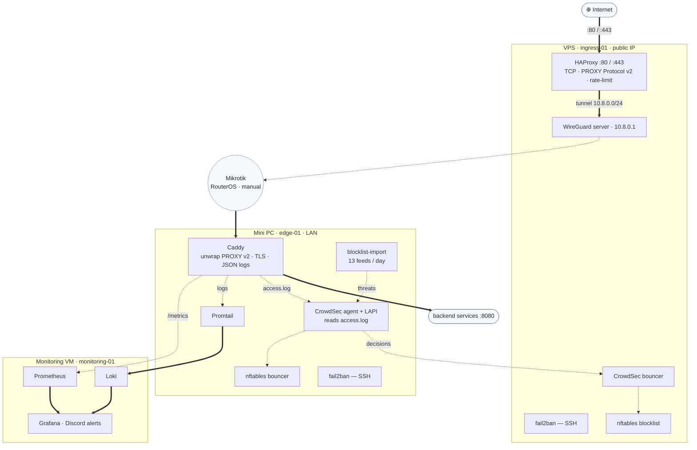

# Homelab Security & Observability Stack


A single-command Ansible project that provisions a hardened 3-node homelab:
**WireGuard** tunneling, **HAProxy** TCP forwarding with PROXY Protocol v2,
**CrowdSec** threat detection + 13 proactive blocklist feeds, **fail2ban** SSH
defense, **Caddy** TLS reverse proxy, and a full **Loki → Prometheus → Grafana**
observability pipeline.

> Replaces the old root-level shell scripts. The Ansible roles are now the single
> source of truth (idempotent, vault-encrypted, lint-clean).

---

## Architecture



**Legend** — `==>` data plane · `-.->` security / observability · grey nodes are
outside Ansible's control.

### How traffic flows

1. A request hits the **VPS** on `:80/:443`. **HAProxy** terminates the TCP
   connection, applies a per-IP rate limit, then forwards over the **WireGuard**
   tunnel prepended with PROXY Protocol v2 (so the real client IP survives).
2. The **Mikrotik** router (configured manually — RouterOS has no Ansible module)
   routes the tunnel traffic to the **Mini PC**.
3. **Caddy** on the Mini PC unwraps PROXY Protocol v2, terminates TLS, and
   reverse-proxies to your backend.
4. In parallel, **CrowdSec** reads Caddy's JSON access log, and **Promtail**
   ships those logs to the **Monitoring VM**.

## Node Inventory

| Node | Ansible host | Runs |
|------|--------------|------|
| **VPS** (Hetzner/DigitalOcean) | `ingress-01` | HAProxy, WireGuard server, nftables blocklist, CrowdSec bouncer, fail2ban (SSH) |
| **Mini PC** | `edge-01` | Caddy, CrowdSec agent + LAPI + bouncer, blocklist-import, fail2ban (SSH), Promtail |
| **Monitoring VM** | `monitoring-01` | Loki, Prometheus, Grafana (Docker Compose) |

## Security Design

### CrowdSec — web threat detection + proactive blocking

Runs on the edge node as the **LAPI** server. It tails Caddy's JSON access log
and applies community Hub scenarios — `crowdsecurity/caddy`,
`crowdsecurity/base-http-scenarios`, `crowdsecurity/http-cve` — to catch
scanners, CVE probes, and flooding. Scenarios are community-maintained and
auto-update.

Two **nftables bouncers** enforce decisions:
- **Edge bouncer** (Mini PC) — drops banned IPs before they reach Caddy.
- **VPS bouncer** — queries the edge LAPI over the WireGuard tunnel and drops IPs
  at the public ingress *before* they waste tunnel bandwidth.

**blocklist-import** — a Docker container on the edge pulls 13 proactive feeds
daily (Spamhaus DROP/eDROP, Firehol L1/L2, DShield, Emerging Threats, Talos,
CIARMY, GreenSnow, StopForumSpam, Tor exits, CrowdSec community list). Decisions
carry a 24-hour TTL.

**LAPI hardening** — the socket binds to `0.0.0.0` but an nftables chain
(`crowdsec-lapi`) accepts only `127.0.0.1` and the VPS WireGuard IP
(`10.8.0.1`). The rule is applied *before* CrowdSec starts to close the window.

### fail2ban — SSH brute-force (both nodes)

SSH-only, incremental banning via `nftables[type=allports]`:

| Offence | Ban duration |
|---------|--------------|
| 1st | 5 min |
| 2nd | 25 min |
| 3rd | 2.5 h |
| 4th | 5 h |
| 5th+ | 25 h |

### General

- **Ansible Vault (AES-256)** encrypts every secret; `.example` files document
  them, real configs are gitignored.
- **PROXY Protocol v2** carries the true client IP end-to-end, so detection and
  banning always act on the real source.
- **nftables TTL bans** auto-expire — no manual unban needed in the normal path.

## Observability

`Promtail → Loki → Prometheus → Grafana` on the Monitoring VM (Docker Compose):

- **Promtail** ships Caddy + fail2ban logs from the edge to **Loki**.
- **Prometheus** scrapes Caddy's `/metrics` endpoint (admin API bound to the LAN
  IP, restricted to the Monitoring VM by nftables).
- **Grafana** ships with a provisioned homelab dashboard + a Discord alert when
  disk usage crosses the threshold.
- All Docker ports bind to `monitoring_ip` (never `0.0.0.0`).

## Prerequisites

- Ansible 2.14+ and `ansible-lint` on your laptop
- Required collections: `ansible-galaxy collection install -r ansible/requirements.yml`
- Three nodes (VPS + Mini PC + Monitoring VM) on Debian/Ubuntu
- Mikrotik set up manually — see [`routeros-wireguard-setup.txt`](routeros-wireguard-setup.txt)

## Quick Start

```bash
# 1. Copy and fill in config files
cp ansible/inventory/hosts.yml.example        ansible/inventory/hosts.yml
cp ansible/group_vars/all/config.yml.example  ansible/group_vars/all/config.yml
# Edit both with real IPs, domain, ports

# 2. Pre-generate keys, then seal them in the vault
#    WireGuard:  wg genkey | tee private.key | wg pubkey > public.key
ansible-vault edit ansible/group_vars/all/vault.yml

# 3. Bootstrap the deploy user on each host (one-time)
ansible-playbook ansible/bootstrap.yml -u <your_user> -k -K
# Non-default key path? add:  -e bootstrap_ssh_pubkey=~/.ssh/id_rsa.pub

# 4. Deploy the whole stack
ansible-playbook ansible/site.yml --vault-password-file ansible/.vault_password

# 5. Add a WireGuard client (writes <client>.conf locally — no key in stdout)
ansible-playbook ansible/add-client.yml --vault-password-file ansible/.vault_password
```

## Operations

Manual, out-of-band enforcement on the VPS nftables blocklist:

```bash
# Ban an IP for N seconds (uses the restricted banagent account)
ssh -i <vps_ban private key> banagent@<ingress_ip> "203.0.113.5 3600"

# Unban an IP (playbook validates the IP format)
ansible-playbook ansible/unban.yml
```

## Repository Layout

```
ansible/
├── site.yml              # deploy all roles in order (ingress / edge / monitoring)
├── add-client.yml        # add WireGuard peer → writes client.conf locally
├── bootstrap.yml         # one-time: create deploy user + install SSH key
├── unban.yml             # manual unban (prompts for IP)
├── inventory/hosts.yml.example
└── group_vars/all/
    ├── config.yml.example  # all variables documented
    └── vault.yml           # Ansible Vault encrypted secrets
roles/
├── wireguard-server/    # ingress-01: WG server + peer mgmt (wg0 + wg0-peers.conf)
├── haproxy/             # ingress-01: TCP forward + PROXY v2 + rate limiting
├── vps-blocklist/       # ingress-01: nftables blocklist + banagent ban-ip tool
├── fail2ban/            # both nodes: SSH incremental banning via nftables
├── crowdsec/            # edge-01: LAPI + Hub + blocklist-import  |  ingress-01: bouncer
├── caddy/               # edge-01: reverse proxy + metrics + nftables ACL
├── promtail/            # edge-01: log shipping to Loki
└── monitoring/          # monitoring-01: Docker Compose observability stack
```

## Vault Variables

See [`ansible/group_vars/all/vault.yml.example`](ansible/group_vars/all/vault.yml.example)
for the full list. Highlights:

| Variable | Purpose |
|----------|---------|
| `vault_wireguard_server_private_key` | WireGuard server private key |
| `vault_wireguard_server_public_key` | Server public key (distributed to clients) |
| `vault_vps_ban_ssh_private_key` | Key for the emergency `banagent` command |
| `vault_vps_ban_ssh_public_key` | Public half (installed in banagent `authorized_keys`) |
| `vault_grafana_admin_user` / `..._password` | Grafana admin credentials |
| `vault_grafana_discord_webhook` | Discord webhook for disk alerts |
| `vault_crowdsec_vps_bouncer_key` | Pre-shared key for the VPS CrowdSec bouncer |
| `vault_crowdsec_edge_bouncer_key` | Pre-shared key for the edge CrowdSec bouncer |
| `vault_crowdsec_machine_password` | Password for the blocklist-import machine account |

## Skills Demonstrated

| Area | Implementation |
|------|----------------|
| Infrastructure as Code | Idempotent Ansible roles, inventory groups, FQCN modules |
| Networking | WireGuard VPN, HAProxy TCP mode, PROXY Protocol v2, nftables |
| Security | CrowdSec detection, proactive blocklist feeds, fail2ban, Ansible Vault |
| Threat intelligence | 13-feed blocklist-import, CrowdSec Hub scenarios |
| Observability | Loki + Prometheus + Grafana, Discord alerting |
| Secrets management | Ansible Vault AES-256, gitignored configs, `.example` templates |
| CI | GitHub Actions `ansible-lint` (production profile, 0 failures) |
