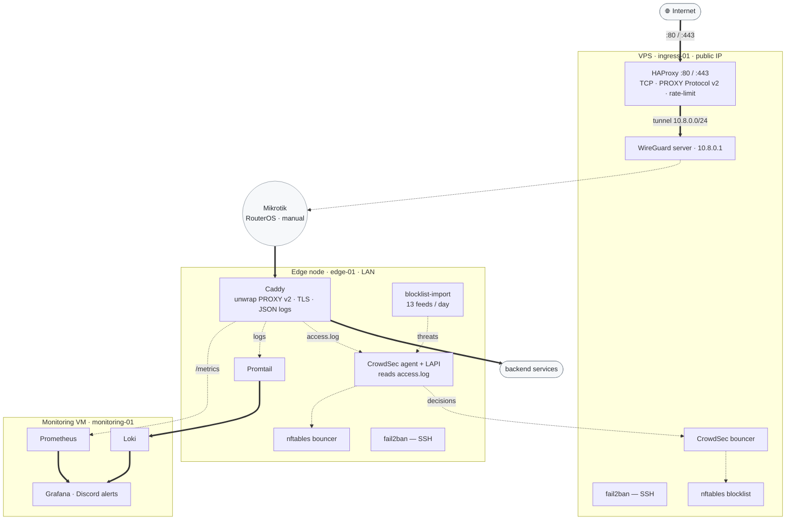

# Self-hosting from behind CGNAT


My home connection sits behind CGNAT — no public IP, no port forwarding. This
repo is how I expose home-hosted services anyway: a cheap VPS acts as a rented
front door, a WireGuard tunnel carries traffic home, and defense-in-depth runs
on both ends. One Ansible command provisions all three nodes.

**Why not the obvious alternatives?** A Cloudflare Tunnel means a third party
terminates my TLS and owns my ingress. A plain reverse proxy on the VPS means
the provider sees plaintext and every backend log shows the VPS's IP instead
of the real client. Instead: HAProxy on the VPS forwards **raw TCP** with
**PROXY Protocol v2**, so TLS terminates at home and the original client IP
survives end-to-end — which is what makes real per-IP detection and banning
possible.

## Architecture


```mermaid
flowchart TD
    NET(["🌐 Internet"]):::ext

    subgraph VPS["VPS · ingress-01 · public IP"]
        HA["HAProxy :80 / :443<br/>TCP · PROXY Protocol v2 · rate-limit"]
        WG["WireGuard server · 10.8.0.1"]
        F2B1["fail2ban — SSH"]
        CSB["CrowdSec bouncer"]
        BL1["nftables blocklist"]
    end

    MIK(("Mikrotik<br/>RouterOS · manual")):::ext

    subgraph EDGE["Edge node · edge-01 · LAN"]
        CAD["Caddy<br/>unwrap PROXY v2 · TLS · JSON logs"]
        CSA["CrowdSec agent + LAPI<br/>reads access.log"]
        BLI["blocklist-import<br/>13 feeds / day"]
        BL2["nftables bouncer"]
        F2B2["fail2ban — SSH"]
        PT["Promtail"]
    end

    BACK(["backend services"]):::ext

    subgraph MON["Monitoring VM · monitoring-01"]
        LOKI["Loki"]
        PROME["Prometheus"]
        GRAF["Grafana · Discord alerts"]
    end

    %% ── data plane ──
    NET ==>|":80 / :443"| HA
    HA ==>|"tunnel 10.8.0.0/24"| WG
    WG -.-> MIK
    MIK ==> CAD
    CAD ==> BACK

    %% ── security plane ──
    CAD -.->|"access.log"| CSA
    BLI -.->|"threats"| CSA
    CSA -.->|"decisions"| CSB
    CSB -.-> BL1
    CSA -.-> BL2

    %% ── observability plane ──
    CAD -.->|"logs"| PT
    PT ==> LOKI
    CAD -.->|"/metrics"| PROME
    PROME ==> GRAF
    LOKI ==> GRAF

    classDef ext fill:#f6f8fa,stroke:#8c959f,color:#24292f;
```

**Legend** — `==>` data plane · `-.->` security / observability · grey nodes are
outside Ansible's control.

### How traffic flows

1. A request hits the **VPS** on `:80/:443`. **HAProxy** applies a per-IP rate
   limit and forwards the raw TCP over the **WireGuard** tunnel, prepended with
   PROXY Protocol v2.
2. The **Mikrotik** router routes tunnel traffic to the **Edge node**
   ([manual setup](docs/routeros.md)).
3. **Caddy** unwraps PROXY v2, terminates TLS (Cloudflare DNS-01 — no inbound
   port 80 needed for ACME), and reverse-proxies to LAN backends.
4. In parallel, **CrowdSec** reads Caddy's JSON access log and **Promtail**
   ships it to the Monitoring VM.

## Design decisions

- **HAProxy runs in TCP mode, not HTTP.** TLS terminates at home; the VPS
  provider never sees plaintext. PROXY Protocol v2 is the price of that choice
  — and the reason client IPs still reach Caddy, CrowdSec, and fail2ban.
- **Bans are enforced on the VPS, not just at home.** The VPS bouncer queries
  the edge LAPI over the tunnel and drops banned IPs at the public ingress —
  tunnel bandwidth is the scarce resource, so garbage traffic dies before it.
- **The LAPI firewall fence is applied *before* CrowdSec starts.** The API
  binds `0.0.0.0`, but an nftables chain restricting it to `127.0.0.1` + the
  VPS tunnel IP is loaded first, so there is no unfenced window.
- **The edge play deploys before the ingress play.** The LAPI and its
  registered bouncer keys must exist before the VPS bouncer starts — see the
  post-mortem below.
- **Every play starts with a preflight `assert` on the network contract** —
  the cross-node ports and tunnel IPs that several roles must agree on
  (documented in [CONTEXT.md](CONTEXT.md)). A mismatch fails in seconds, not
  at runtime on the box.
- **Repeated rituals live behind seams.** Every apt source goes through one
  parameterized task file (`tasks/apt_repo.yml`), every firewall drop-in
  through another (`tasks/nft_dropin.yml`) — each role is self-sufficient
  regardless of play order, and a fix lands once instead of five times.
- **This repo is a provisioning scaffold by design.** Caddy site blocks are
  hand-authored on the host (`/etc/caddy/conf.d/*.caddy`); real inventory,
  variables, and secrets are gitignored. What you see here is everything that
  is safe to publish.

## Security model

**CrowdSec** runs its LAPI on the edge node, tailing Caddy's JSON access log
with community Hub scenarios (`crowdsecurity/caddy`, `base-http-scenarios`,
`http-cve`) to catch scanners, CVE probes, and floods. Decisions are enforced
by two nftables bouncers — one on the edge, one on the VPS. A
**blocklist-import** container adds 13 proactive feeds daily (Spamhaus
DROP/eDROP, Firehol L1/L2, DShield, Emerging Threats, Talos, CIARMY,
GreenSnow, StopForumSpam, Tor exits, and more) with 24-hour TTLs.

**fail2ban** covers SSH on both nodes with incremental bans
(`nftables[type=allports]`):

| Offence | 1st | 2nd | 3rd | 4th | 5th+ |
|---------|-----|-----|-----|-----|------|
| Ban     | 5 min | 25 min | 2.5 h | 5 h | 25 h |

**Secrets** live in Ansible Vault (AES-256); `.example` files document every
variable and the real configs never touch git. nftables drop-ins fence the
CrowdSec LAPI and Caddy admin/metrics ports to exactly the hosts that need
them.

## Observability

`Promtail → Loki` for logs, `Prometheus → Grafana` for metrics, all Docker
Compose on the monitoring VM. Grafana ships with a provisioned homelab
dashboard and a Discord alert on disk pressure. Caddy's admin API binds the
LAN IP only, and its metrics port is nftables-restricted to the monitoring
VM; all monitoring ports bind `monitoring_ip`, never `0.0.0.0`.

## Quick start

```bash
# 1. Copy and fill in config files (real files are gitignored)
cp ansible/inventory/hosts.yml.example        ansible/inventory/hosts.yml
cp ansible/group_vars/all/config.yml.example  ansible/group_vars/all/config.yml

# 2. Pre-generate keys, then seal them in the vault
#    WireGuard:  wg genkey | tee private.key | wg pubkey > public.key
ansible-vault edit ansible/group_vars/all/vault.yml

# 3. Bootstrap the deploy user on each host (one-time)
ansible-playbook ansible/bootstrap.yml -u <your_user> -k -K

# 4. Deploy the whole stack — each play preflight-asserts the network
#    contract before touching anything
ansible-playbook ansible/site.yml --vault-password-file .vault_password

# 5. Add a WireGuard client (writes <client>.conf locally — no key in stdout)
ansible-playbook ansible/add-client.yml --vault-password-file .vault_password
```

Full variable reference: [docs/configuration.md](docs/configuration.md).

### Operations

```bash
# Emergency ban on the VPS blocklist (restricted SSH forced-command account)
ssh -i <vps_ban private key> banagent@<ingress_ip> "203.0.113.5 3600"

# Unban an IP (playbook validates the IP format)
ansible-playbook ansible/unban.yml
```

## Repository layout

```
ansible/
├── site.yml              # deploy all roles in order (edge → ingress → monitoring)
├── add-client.yml        # add WireGuard peer → writes client.conf locally
├── bootstrap.yml         # one-time: create deploy user + install SSH key
├── unban.yml             # manual unban (prompts for IP)
├── tasks/                # shared rituals: apt_repo.yml, nft_dropin.yml
└── group_vars/all/       # config.yml.example + vault.yml (encrypted)
roles/
├── wireguard-server/    # ingress: WG server + peer management
├── haproxy/             # ingress: TCP forward + PROXY v2 + rate limiting
├── vps-blocklist/       # ingress: nftables blocklist + banagent tool
├── fail2ban/            # both: SSH incremental banning
├── crowdsec-lapi/       # edge: LAPI + Hub + key registration + blocklist-import
├── crowdsec-bouncer/    # both: firewall bouncer (lapi_host + key set per play)
├── docker/              # shared: Docker CE install
├── caddy/               # edge: reverse proxy + metrics + nftables ACL
├── promtail/            # edge: log shipping to Loki
└── monitoring/          # monitoring: Compose observability stack
```

Architecture vocabulary and cross-role contracts: [CONTEXT.md](CONTEXT.md).

## Post-mortem: the first-deploy race

On a clean deploy, the VPS CrowdSec bouncer started before the edge LAPI it
registers against existed — the ingress play simply ran first, so the first
run always "failed" and only converged on a re-run. The fix was twofold:
reorder `site.yml` so the edge play (LAPI + bouncer-key registration) runs
first, and split the old dual-personality crowdsec role into `crowdsec-lapi`
and a topology-agnostic `crowdsec-bouncer` so the dependency is visible in
the play instead of buried in template conditionals.

## Limitations & roadmap

- **RouterOS is out of Ansible scope for now.** The manual configuration is
  documented step-by-step in [docs/routeros.md](docs/routeros.md); automating
  it via the community RouterOS collection is the top roadmap item.
- **No molecule tests yet.** The preflight asserts and `caddy validate` /
  `visudo -cf` template validation cover part of that gap; molecule scenarios
  for the crowdsec roles are next.
- **CrowdSec pins Debian `bookworm`** — packagecloud publishes no trixie
  build yet; the pin is deliberate and commented in the roles.
- **Single-operator homelab scale.** No HA anywhere, and that's a non-goal:
  the VPS is disposable and re-provisionable in one command.
