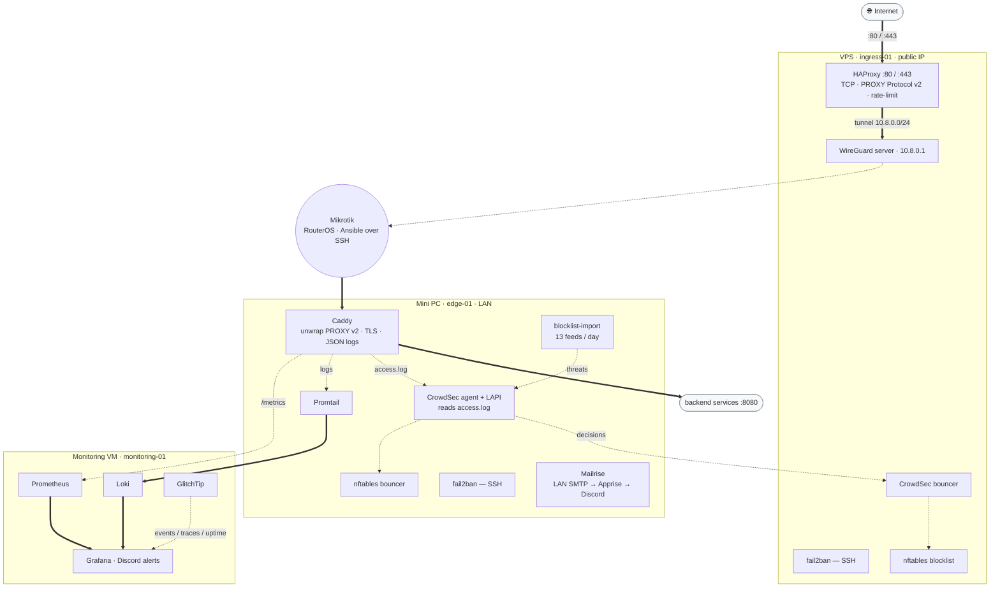

# Homelab Security & Observability Stack


A single-command Ansible project that provisions a hardened 3-node homelab:
**WireGuard** tunneling, **HAProxy** TCP forwarding with PROXY Protocol v2,
**CrowdSec** threat detection + 13 proactive blocklist feeds, **fail2ban** SSH
defense, **Caddy** TLS reverse proxy, a full **Loki → Prometheus → Grafana**
observability pipeline, and **GlitchTip** for app errors, traces, and uptime.

> Replaces the old root-level shell scripts. The Ansible roles are now the single
> source of truth (idempotent, vault-encrypted, lint-clean).

---

## Architecture


```mermaid
flowchart TD
    NET(["🌐 Internet"]):::ext

    subgraph VPS["VPS · ingress-01 · public IP"]
        HA["HAProxy :80 / :443<br/>TCP · PROXY Protocol v2 · rate-limit"]
        WG["WireGuard server · 10.8.0.1"]
        F2B1["fail2ban — SSH"]
        CSB["CrowdSec bouncer"]
        BL1["nftables blocklist"]
    end

    MIK(("Mikrotik<br/>RouterOS · Ansible over SSH"))

    subgraph EDGE["Mini PC · edge-01 · LAN"]
        CAD["Caddy<br/>unwrap PROXY v2 · TLS · JSON logs"]
        CSA["CrowdSec agent + LAPI<br/>reads access.log"]
        BLI["blocklist-import<br/>13 feeds / day"]
        BL2["nftables bouncer"]
        F2B2["fail2ban — SSH"]
        PT["Promtail"]
        MR["Mailrise<br/>LAN SMTP → Apprise → Discord"]
    end

    BACK(["backend services :8080"]):::ext

    subgraph MON["Monitoring VM · monitoring-01"]
        LOKI["Loki"]
        PROME["Prometheus"]
        GRAF["Grafana · Discord alerts"]
        GLT["GlitchTip"]
    end

    %% ── data plane ──
    NET ==>|":80 / :443"| HA
    HA ==>|"tunnel 10.8.0.0/24"| WG
    WG -.-> MIK
    MIK ==> CAD
    CAD ==> BACK

    %% ── security plane ──
    CAD -.->|"access.log"| CSA
    BLI -.->|"threats"| CSA
    CSA -.->|"decisions"| CSB
    CSB -.-> BL1
    CSA -.-> BL2

    %% ── observability plane ──
    CAD -.->|"logs"| PT
    PT ==> LOKI
    CAD -.->|"/metrics"| PROME
    PROME ==> GRAF
    LOKI ==> GRAF
    GLT -.->|"events / traces / uptime"| GRAF

    classDef ext fill:#f6f8fa,stroke:#8c959f,color:#24292f;
```

**Legend** — `==>` data plane · `-.->` security / observability · grey nodes are
outside Ansible's control.

### How traffic flows

1. A request hits the **VPS** on `:80/:443`. **HAProxy** terminates the TCP
   connection, applies a per-IP rate limit, then forwards over the **WireGuard**
   tunnel prepended with PROXY Protocol v2 (so the real client IP survives).
2. The **Mikrotik** router (provisioned by the `mikrotik-wireguard` role over
   SSH — agentless, no Python on the router) routes the tunnel traffic to the
   **Mini PC**.
3. **Caddy** on the Mini PC unwraps PROXY Protocol v2, terminates TLS, and
   reverse-proxies to your backend.
   Sites listed in `caddy_sites` (e.g. GlitchTip at `sentry.<domain>`) are
   rendered into the managed Caddyfile and validated before reload;
   hand-written files in `/etc/caddy/conf.d/` still load alongside them.
4. In parallel, **CrowdSec** reads Caddy's JSON access log, and **Promtail**
   ships those logs to the **Monitoring VM**.

## Node Inventory

| Node                           | Ansible host    | Runs                                                                                         |
| ------------------------------ | --------------- | -------------------------------------------------------------------------------------------- |
| **VPS** (Hetzner/DigitalOcean) | `ingress-01`    | HAProxy, WireGuard server, nftables blocklist, CrowdSec bouncer, fail2ban (SSH)              |
| **Mini PC**                    | `edge-01`       | Caddy, CrowdSec agent + LAPI + bouncer, blocklist-import, fail2ban (SSH), Promtail, Mailrise |
| **Monitoring VM**              | `monitoring-01` | Loki, Prometheus, Grafana (Docker Compose)                                                   |
| **Tools VM** (Proxmox)         | `tools-01`      | Penpot, self-hosted GitHub Actions runners, node-exporter                                    |

## Security Design

### CrowdSec — web threat detection + proactive blocking

Runs on the edge node as the **LAPI** server. It tails Caddy's JSON access log
and applies community Hub scenarios — `crowdsecurity/caddy`,
`crowdsecurity/base-http-scenarios`, `crowdsecurity/http-cve` — to catch
scanners, CVE probes, and flooding. Scenarios are community-maintained and
auto-update.

Two **nftables bouncers** enforce decisions:

- **Edge bouncer** (Mini PC) — drops banned IPs before they reach Caddy.
- **VPS bouncer** — queries the edge LAPI over the WireGuard tunnel and drops IPs
  at the public ingress _before_ they waste tunnel bandwidth.

**blocklist-import** — a Docker container on the edge pulls 13 proactive feeds
daily (Spamhaus DROP/eDROP, Firehol L1/L2, DShield, Emerging Threats, Talos,
CIARMY, GreenSnow, StopForumSpam, Tor exits, CrowdSec community list). Decisions
carry a 24-hour TTL.

**LAPI hardening** — the socket binds to `0.0.0.0` but an nftables chain
(`crowdsec-lapi`) accepts only `127.0.0.1` and the VPS WireGuard IP
(`10.8.0.1`). The rule is applied _before_ CrowdSec starts to close the window.

### fail2ban — SSH brute-force (both nodes)

SSH-only, incremental banning via `nftables[type=allports]`:

| Offence | Ban duration |
| ------- | ------------ |
| 1st     | 5 min        |
| 2nd     | 25 min       |
| 3rd     | 2.5 h        |
| 4th     | 5 h          |
| 5th+    | 25 h         |

### General

- **Ansible Vault (AES-256)** encrypts every secret; `.example` files document
  them, real configs are gitignored.
- **PROXY Protocol v2** carries the true client IP end-to-end, so detection and
  banning always act on the real source.
- **nftables TTL bans** auto-expire — no manual unban needed in the normal path.

## Notifications

**Mailrise** on the edge node is an internal SMTP gateway: anything that can only
send email (Proxmox, smartd, cron, Penpot) mails `<channel>@mailrise.lan` at
`edge_ip:8025`, and Mailrise posts it to that channel's Discord webhook via
Apprise. Channels are the keys of `vault_notify_discord_webhooks`.

- Runs from a pinned Python venv as a hardened systemd service (no Docker).
- LAN only: an nftables chain (`mailrise`) drops port 8025 from anything outside
  `wireguard_lan_cidr`, and the VPS never forwards it.
- Grafana and GlitchTip keep their native Discord integrations.

## Observability

`Promtail → Loki → Prometheus → Grafana`, plus `GlitchTip`, on the Monitoring VM
(Docker Compose):

- **Promtail** ships Caddy + fail2ban logs from the edge to **Loki**.
- **Prometheus** scrapes Caddy's `/metrics` endpoint (admin API bound to the LAN
  IP, restricted to the Monitoring VM by nftables).
- **Grafana** ships with a provisioned homelab dashboard + a Discord alert when
  disk usage crosses the threshold.
- **GlitchTip** runs self-hosted with its own Postgres + Valkey services and
  exposes the Sentry-compatible UI on `glitchtip_port` (default `8000`). Set
  `glitchtip_domain` to the URL you actually serve, either through your reverse
  proxy or directly as `http://<monitoring_ip>:8000`.
- All Docker ports bind to `monitoring_ip` (never `0.0.0.0`).

## Prerequisites

- [`uv`](https://docs.astral.sh/uv/) on the control machine (`run.sh` pins Ansible and installs collections)
- Three nodes (VPS + Mini PC + Monitoring VM) on Debian/Ubuntu
- Mikrotik (RouterOS 7) reachable over SSH with your pubkey — one-time
  `/user ssh-keys import` (see [`routeros-wireguard-setup.txt`](routeros-wireguard-setup.txt));
  `site.yml` then provisions the tunnel + CGNAT watchdog

## Quick Start

Everything needed to deploy is committed: the inventory, the **vault-encrypted**
`config.yml` (real IPs, domains) and `vault.yml` (secrets). A control machine
only needs [`uv`](https://docs.astral.sh/uv/), the vault password, and an SSH key
authorized as `deploy`. `run.sh` pins Ansible and installs collections itself.

```bash
git clone git@github.com:Chalvin96/wireguard-setup.git && cd wireguard-setup

./run.sh edge-01 --check --diff   # dry run one host; asks for the vault password
./run.sh edge-01                  # apply one host or group
./run.sh                          # apply everything (site.yml)
```

Put the password in `.vault_password` (gitignored) to skip the prompt;
otherwise it is asked once per run and kept only in RAM.

| Command                                                          | Purpose                                                                                                                               |
| ---------------------------------------------------------------- | ------------------------------------------------------------------------------------------------------------------------------------- |
| `./run.sh edit-config`                                           | Create (from `config.yml.example`) or edit the encrypted `config.yml`                                                                 |
| `./run.sh edit-vault`                                            | Edit the encrypted `vault.yml`                                                                                                        |
| `./run.sh bootstrap --limit <host> -e ansible_user=<user> -k -K` | New host: create `deploy`, install keys, disable password SSH (`-e`, not `-u`: the inventory's `ansible_user: deploy` overrides `-u`) |
| `./run.sh bootstrap`                                             | Authorize machines listed in `deploy_authorized_keys` (run from an authorized machine)                                                |
| `./run.sh lint`                                                  | ansible-lint with the CI pins                                                                                                         |

**Adding a control machine:** append its public key to `deploy_authorized_keys`
(`./run.sh edit-config`), run `./run.sh bootstrap` from a machine that already
has access, commit. No private keys are stored in the repository.

**Add a WireGuard client** (writes `<client>.conf` locally — no key in stdout):

```bash
uvx --python 3.12 --from 'ansible-core>=2.17,<2.18' ansible-playbook ansible/add-client.yml --ask-vault-pass
```

## Operations

Manual, out-of-band enforcement on the VPS nftables blocklist:

```bash
# Ban an IP for N seconds (uses the restricted banagent account)
ssh -i <vps_ban private key> banagent@<ingress_ip> "203.0.113.5 3600"

# Unban an IP (playbook validates the IP format)
ansible-playbook ansible/unban.yml
```

## Tools VM

VM hardware can be provisioned with [OpenTofu](infra/proxmox/README.md).
Existing VMs are not adopted automatically; import and review their plans first.

A Proxmox VM with two virtual disks, created by hand before `bootstrap.yml`:

| Disk           | Role | Mount  | Holds                                                              |
| -------------- | ---- | ------ | ------------------------------------------------------------------ |
| `scsi0` 64 GB  | Boot | `/`    | OS, packages and system logs                                       |
| `scsi1` 128 GB | Data | `/srv` | Penpot data/backups, Docker data/cache and runner homes/workspaces |

Mount the data disk at `/srv` (fstab by UUID, `defaults,noatime`) when you create the
VM; the roles assume it is already mounted.

Bind the Docker and runner `/var/lib` directories from `/srv` as described in
[the storage procedure](docs/rootless-docker.md). Existing hosts require a
maintenance copy and verification; do not mount over live data.

- **docker** installs separate rootless Docker daemons for applications (`apps`)
  and CI (`github-runner`), each with log rotation and a weekly prune timer.
- **penpot** runs Penpot from `/srv/penpot`, bound to `tools_ip`, with a nightly
  `pg_dump` + assets archive into `/srv/backups/penpot`.
- **github-runner** registers one runner per repository in
  `github_runner_repos` using a fine-grained PAT from the vault.

> **Private repositories only.** A self-hosted runner on a public repository
> runs code from fork pull requests on this LAN. CI has its own rootless daemon
> and cannot manage the applications daemon or read Penpot's private project
> directory. Both runners and their containers share an aggregate CPU/memory
> limit. This is not VM-strength isolation: the kernel, disk, and LAN remain
> shared. Use a dedicated VM and network restrictions for untrusted workloads.

See [rootless Docker operations and migration](docs/rootless-docker.md) before
upgrading an existing rootful installation. Future trusted services can share
the applications daemon with Penpot, using separate Compose projects and
explicit shared networks only when communication is needed.

```bash
./run.sh bootstrap --limit tools-01 -e ansible_user=<your_user> -k -K
./run.sh tools-01 --check --diff
./run.sh tools-01
```

Changing `vault_penpot_postgres_password` does not rotate the password in an
existing PostgreSQL data directory. During a maintenance window, stop the
Penpot backend, change the database role password with an interactive `psql`
`\password penpot` command, update the vault value, and redeploy. Keep the old
credential available for rollback until login succeeds. Do not put the password
in shell arguments or logs. Backups share the data disk; copy a verified backup
off the VM for protection against disk loss.

## Sindri monitoring

The monitoring VM scrapes tools-01's existing Node Exporter. In Grafana, open
**Sindri — Tools VM** (`/d/sindri-tools`) for availability, uptime, CPU, memory,
boot/data disk usage, and network traffic. This is host monitoring; it does not claim
that Penpot requests or GitHub workflow jobs are successful.

## Contributor setup

Use Node.js 22 and `uv` on the control machine. Install the local Git hooks once:

```bash
uv tool install pre-commit
pre-commit install
pre-commit run --all-files
```

Prettier formats YAML, JSON, and Markdown when committing; Gitleaks scans staged
changes for secrets. Both versions are pinned. Encrypted vault files and runtime
artifacts are excluded from formatting. Pre-commit manages the hook environments,
so you do not need to install Prettier or Gitleaks globally for these hooks.

Run `./run.sh lint` for Ansible checks, `bash tests/test-penpot-backup.sh` for backup
failure handling, and `tofu -chdir=infra/proxmox validate` after `tofu init` for VM
configuration. Formatting is also checked in GitHub Actions.

## Repository Layout

```
run.sh                    # clone-and-run entry point (uv-pinned Ansible, vault password once)
ansible/
├── site.yml              # deploy all roles in order (ingress / mikrotik / edge / monitoring / tools)
├── add-client.yml        # add WireGuard peer → writes client.conf locally
├── bootstrap.yml         # one-time: create deploy user + install SSH key
├── unban.yml             # manual unban (prompts for IP)
├── inventory/hosts.yml   # committed; addresses come from encrypted config.yml
└── group_vars/all/
    ├── config.yml          # Ansible Vault encrypted real config
    ├── config.yml.example  # all variables documented
    └── vault.yml           # Ansible Vault encrypted secrets
roles/
├── wireguard-server/    # ingress-01: WG server + peer mgmt (wg0 + wg0-peers.conf)
├── mikrotik-wireguard/  # mikrotik-01: RouterOS WG tunnel + CGNAT watchdog (raw SSH)
├── haproxy/             # ingress-01: TCP forward + PROXY v2 + rate limiting
├── vps-blocklist/       # ingress-01: nftables blocklist + banagent ban-ip tool
├── fail2ban/            # both nodes: SSH incremental banning via nftables
├── crowdsec/            # edge-01: LAPI + Hub + blocklist-import  |  ingress-01: bouncer
├── caddy/               # edge-01: reverse proxy + metrics + nftables ACL
├── promtail/            # edge-01: log shipping to Loki
├── notify/              # edge-01: Mailrise SMTP → Apprise → Discord (LAN only)
├── monitoring/          # monitoring-01: Docker Compose observability stack
├── docker/              # tools-01: Docker CE, log rotation, weekly prune
├── penpot/              # tools-01: Penpot stack + nightly backup timer
└── github-runner/       # tools-01: per-repository Actions runners (private repos only)
```

## Vault Variables

See [`ansible/group_vars/all/vault.yml.example`](ansible/group_vars/all/vault.yml.example)
for the full list. Highlights:

| Variable                                                     | Purpose                                                                           |
| ------------------------------------------------------------ | --------------------------------------------------------------------------------- |
| `vault_wireguard_server_private_key`                         | WireGuard server private key                                                      |
| `vault_wireguard_server_public_key`                          | Server public key (distributed to clients)                                        |
| `vault_wireguard_client_private_key`                         | Mikrotik WireGuard private key (used on first provisioning)                       |
| `vault_wireguard_client_public_key`                          | Mikrotik WireGuard public key (asserted by the verify task)                       |
| `vault_vps_ban_ssh_private_key`                              | Key for the emergency `banagent` command                                          |
| `vault_vps_ban_ssh_public_key`                               | Public half (installed in banagent `authorized_keys`)                             |
| `vault_grafana_admin_user` / `..._password`                  | Grafana admin credentials                                                         |
| `vault_grafana_discord_webhook`                              | Discord webhook for disk alerts                                                   |
| `vault_glitchtip_secret_key`                                 | Django secret key for the GlitchTip instance                                      |
| `vault_glitchtip_postgres_password`                          | URL-safe PostgreSQL password for GlitchTip                                        |
| `vault_glitchtip_email_url`                                  | SMTP or `consolemail://` transport for GlitchTip mail                             |
| `vault_glitchtip_default_from_email`                         | Sender address used by GlitchTip                                                  |
| `vault_crowdsec_vps_bouncer_key`                             | Pre-shared key for the VPS CrowdSec bouncer                                       |
| `vault_crowdsec_edge_bouncer_key`                            | Pre-shared key for the edge CrowdSec bouncer                                      |
| `vault_crowdsec_machine_password`                            | Password for the blocklist-import machine account                                 |
| `vault_notify_discord_webhooks`                              | Channel → Discord webhook map for Mailrise                                        |
| `vault_penpot_secret_key` / `vault_penpot_postgres_password` | Penpot secret key and database password                                           |
| `vault_github_runner_pat`                                    | Fine-grained PAT (Administration: write) used to fetch runner registration tokens |

## Skills Demonstrated

| Area                   | Implementation                                                                            |
| ---------------------- | ----------------------------------------------------------------------------------------- |
| Infrastructure as Code | Idempotent Ansible roles, inventory groups, FQCN modules, agentless RouterOS provisioning |
| Networking             | WireGuard VPN, HAProxy TCP mode, PROXY Protocol v2, nftables                              |
| Security               | CrowdSec detection, proactive blocklist feeds, fail2ban, Ansible Vault                    |
| Threat intelligence    | 13-feed blocklist-import, CrowdSec Hub scenarios                                          |
| Observability          | Loki + Prometheus + Grafana, Discord alerting                                             |
| Secrets management     | Ansible Vault AES-256, gitignored configs, `.example` templates                           |
| CI                     | GitHub Actions `ansible-lint` (production profile, 0 failures)                            |
